# Restaurant Revenue Predictor

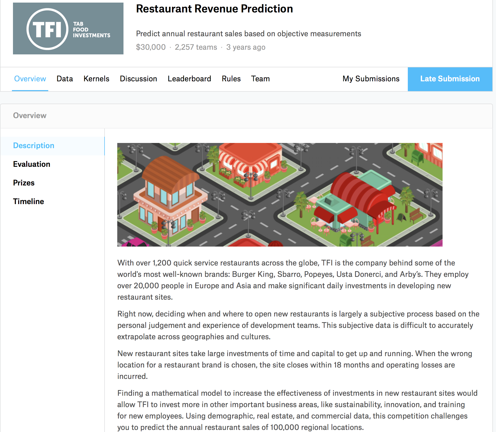

## Workflow:
#### 1. Data Preparation and EDA
  - Initial intuitions
  - Convert categorical data to dummy variables

#### 2. Split Data
   - Hold out
   - Train
   - Test
   - Standardize x's

#### 3. Fit Linear Regression - Calculate RMSE
  - On standardized X, y training set.

#### 4. Try L1 Regularization - Calculate RMSE

#### 5. Manually Engineer Features - Calculate RMSE
  - In depth analysis of assumptions for linear analysis.

#### 6. Choose Best Model

#### 7. Unsolved Mysteries / Needed Improvements

## 1. Data prep and EDA

#### Data Description
TFI has provided a dataset with 137 restaurants in the training set, and a test set of 100000 restaurants. The data columns include the open date, location, city type, and three categories of obfuscated data: Demographic data, Real estate data, and Commercial data. The revenue column indicates a (transformed) revenue of the restaurant in a given year and is the target of predictive analysis.

###### Data fields

- **Id** : Restaurant id.
- **Open Date** : opening date for a restaurant
- **City** : City that the restaurant is in. Note that there are unicode in the names.
- **City Group**: Type of the city. Big cities, or Other.
- **Type**: Type of the restaurant. FC: Food Court, IL: Inline, DT: Drive Thru, MB: Mobile
- **P1, P2 - P37**: There are three categories of these **obfuscated data.** Demographic data are gathered from third party providers with GIS systems. These include population in any given area, age and gender distribution, development scales. Real estate data mainly relate to the m2 of the location, front facade of the location, car park availability. Commercial data mainly include the existence of points of interest including schools, banks, other QSR operators.
- **Revenue**: The revenue column indicates a (transformed) revenue of the restaurant in a given year and is **the target of predictive analysis.**

##### My Approach
  - Clean and convert categorical features.
  - This leaves me with 50 columns, 137 rows.
  - "Revenue" mean ≈ 4.5 M
  - Begin to build a pipeline for data processing.
  - **Initial inspection suggest highly variable data**
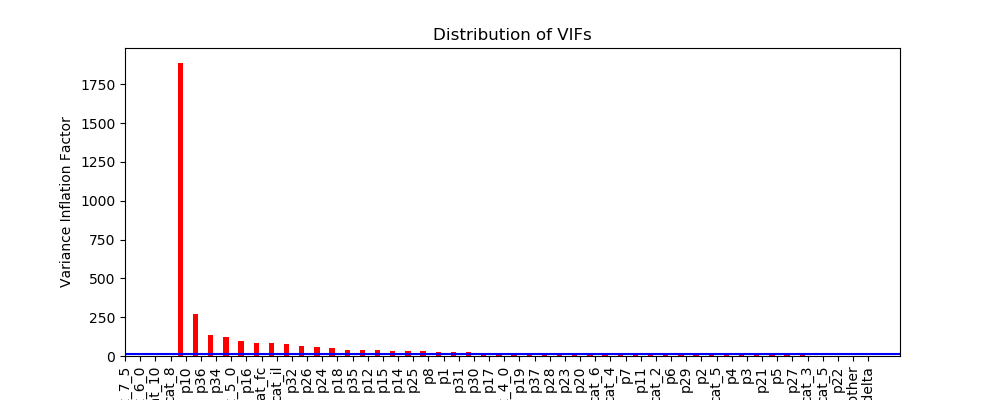
  - Move forward, fully expecting high multicollinearity problems.
  - See if an L1 regularization can solve some problems.

#### 2. Split Data
- Hold out: 28 rows
- Training: 87 rows
- Test: 22 rows
- Standardize the features
- Extremely varying results based on how the data was split.

#### 3. Fit Linear Regression - Calculate RMSE
- RMSE ≈ 35 M (Baseline to be improved)
- r2 = -1.71
- Picking any random line would be better than the prediction.
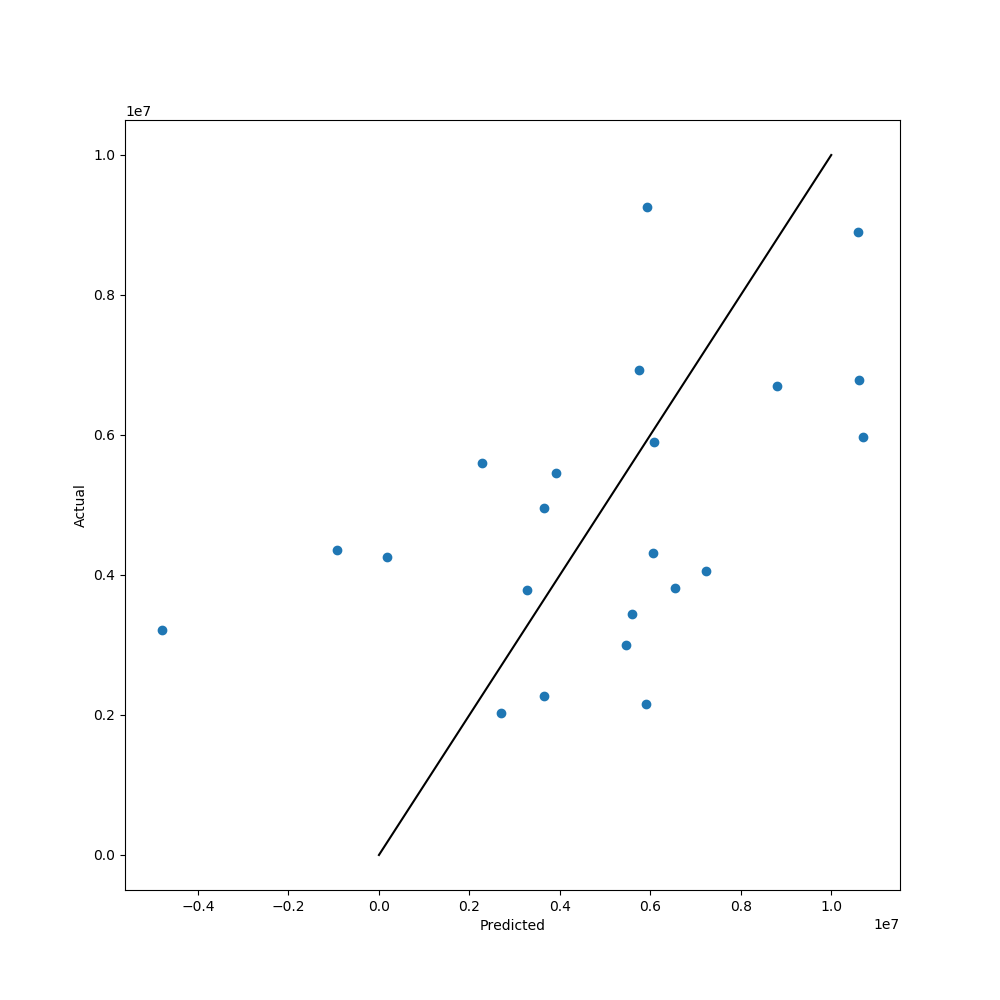

#### 4. Try L1 Regularization - Calculate RMSE
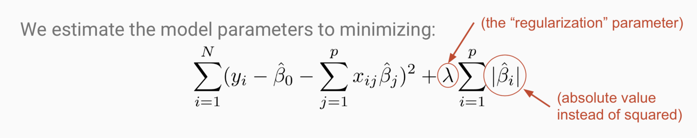

- Borrow code from some genius' repo I found on github: dsi-solns-71
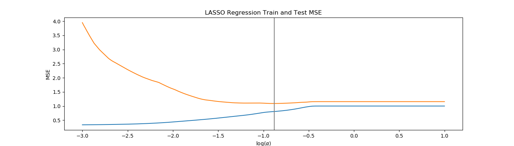
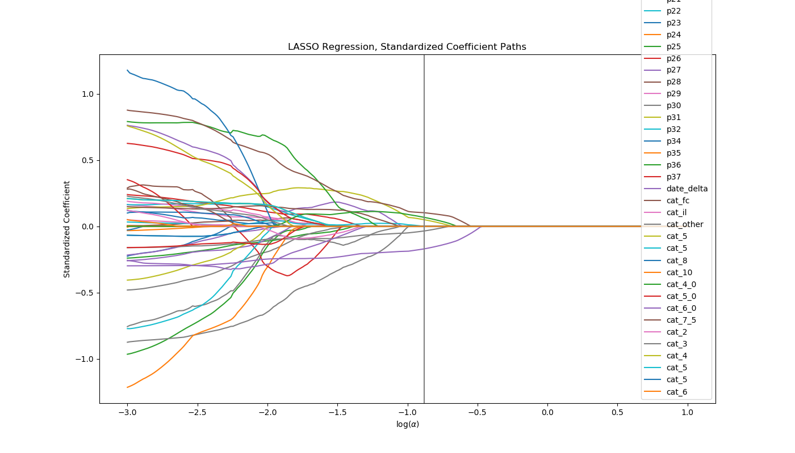

- LASSO model's r2 = .22
- LASSO RMSE ≈ 1.7 M

- Although this seems like an enormous prediction improvement, there were some seriously concerning factors:
  - The variation in the relative improvement
  - The 'convergence errors' and tolerance levels
  - Changing alpha levels had almost no effect on the model's RMSE

#### 5. Manually Engineer Features - Calculate RMSE
- Review of the assumptions for linear regression:
- PART 1: Detect influence, and outliers

##### Multicollinearity

##### Outliers And Leverage Points
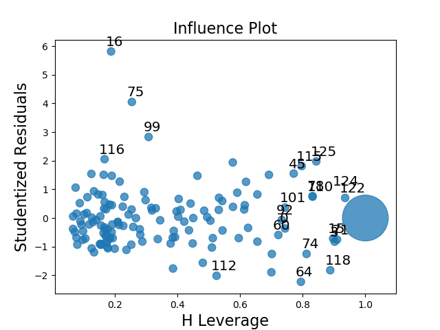

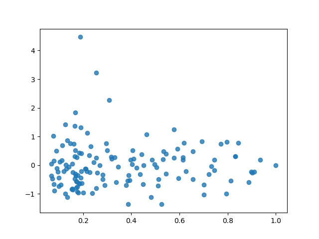

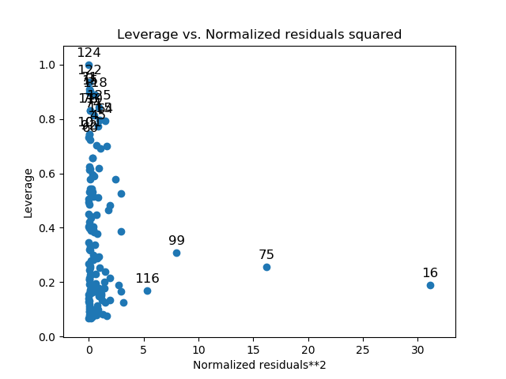

##### Normality of Residuals
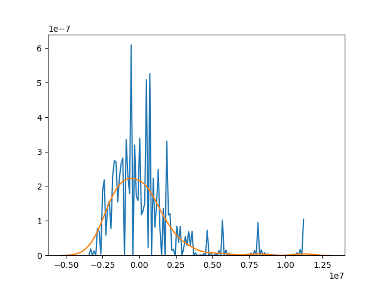

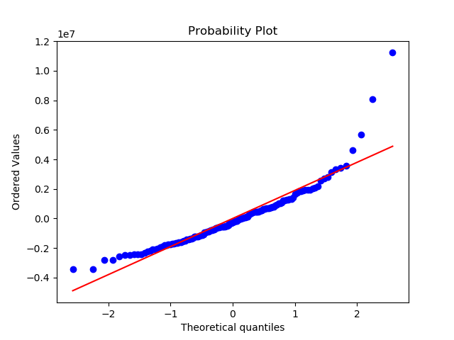

##### Which points to remove?
- Generally, we can take a threshold for a studentized residual of abs(2).
- A point with leverage greater than (2k+2)/n should be carefully examined, where k is the number of predictors and n is the number of observations.In my case this works out to (2*51+2)/137 = .7591
- Finally: **Dropped** 22/137 Rows. **Dropped** 22/50 Columns.
- Alternative: Recursive Feature Selection: Maintain 15 most "important" features.  

#### Re-fit Models:
- Initial Linear RMSE ≈ 35 M
- Removed Influencers Linear RMSE ≈ 1.8 M
- Initial LASSO RMSE ≈ 1.7 M
- Removed Influencers LASSO RMSE ≈ - 1.6 M ?

### To Improve / Unsolved Mysteries
-  I wouldn't have a hold out set. While, it seems like a great idea, you need to get rid of outliers first!
- Recursive feature model_selection
- Get K-Fold to work
- Vastly different values, every time the data is split
- Small dataset, 137 columns, 28 for a hold out... makes it tough to be very consistent, especially with a large variance in the data.
